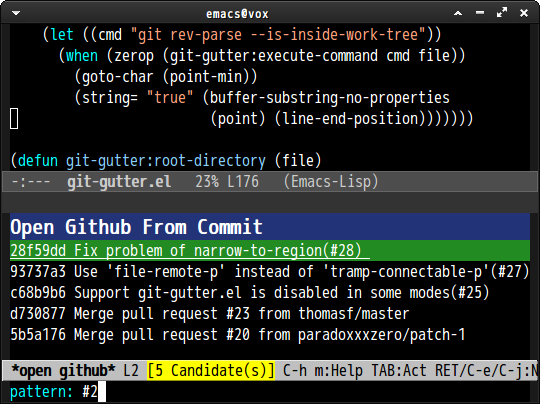

# helm-open-github.el [![melpa badge][melpa-badge]][melpa-link] [![melpa stable badge][melpa-stable-badge]][melpa-stable-link]
helm-open-github.el is utilities for opening github url.
This is inspired by URL below.

- http://shibayu36.hatenablog.com/entry/2013/01/18/211428


## Screenshot




## Installation

You can install `helm-open-github` from [MELPA](http://melpa.org/) with package.el.

```
 M-x package-install helm-open-github
```


## Dependency

* Emacs 24.3 or higher
* [helm](https://github.com/emacs-helm/helm)
* [gh](https://github.com/sigma/gh.el)


## Basic Usage

### `helm-open-github-from-commit`

Open commit page from **Commit ID**

### `helm-open-github-from-file`

Open file page from **File Name**

### `helm-open-github-from-issues`

Open issue page from **Issue ID**

### `helm-open-github-from-pull-requests`

Open pull request page from **Pull Request ID**


## Customize

### `helm-open-github-commit-limit`

Issue number shown by `helm-open-github-from-commit`.(Default: `100`)

### `helm-open-github-requires-pattern`

Minimal length to search. If this value is non-nil, delayed search is enabled(Default: `nil`).
This parameter must be set before loading `helm-open-github.el`.


## Sample Configuration

```lisp
(global-set-key (kbd "C-c o f") 'helm-open-github-from-file)
(global-set-key (kbd "C-c o c") 'helm-open-github-from-commit)
(global-set-key (kbd "C-c o i") 'helm-open-github-from-issues)
(global-set-key (kbd "C-c o p") 'helm-open-github-from-pull-requests)
```

[melpa-link]: https://melpa.org/#/helm-open-github
[melpa-stable-link]: https://stable.melpa.org/#/helm-open-github
[melpa-badge]: https://melpa.org/packages/helm-open-github-badge.svg
[melpa-stable-badge]: https://stable.melpa.org/packages/helm-open-github-badge.svg
